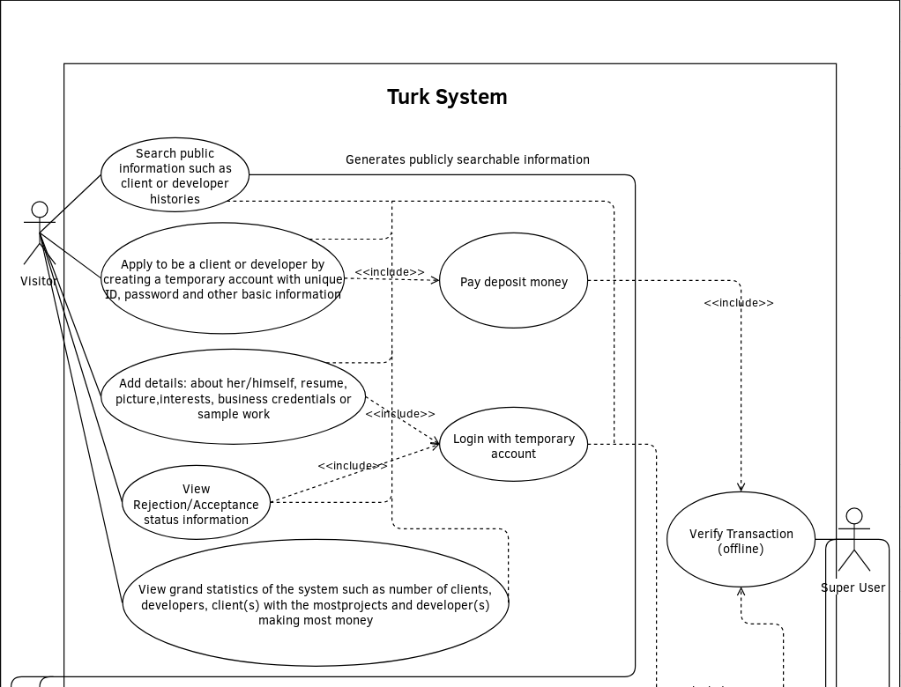
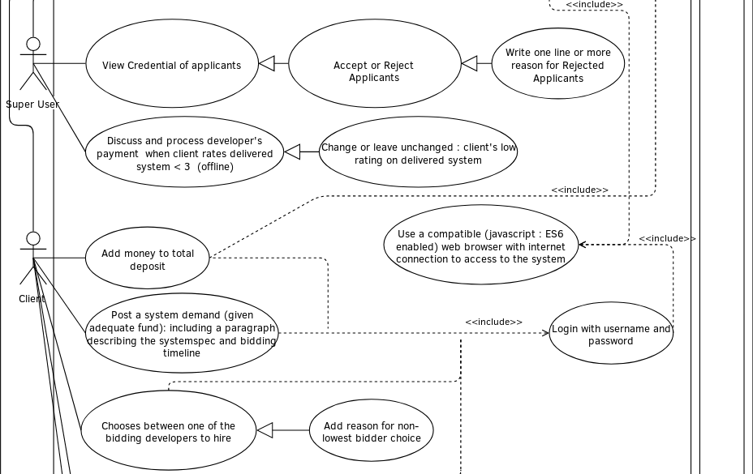
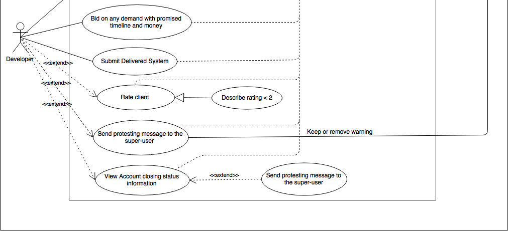
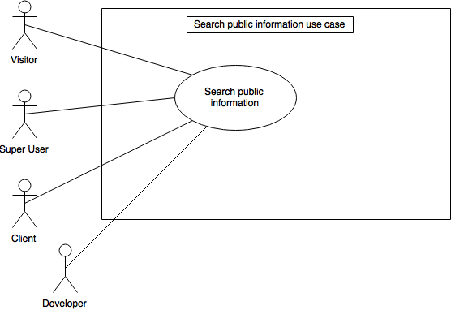
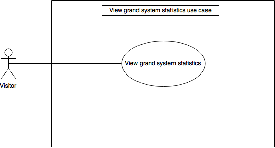
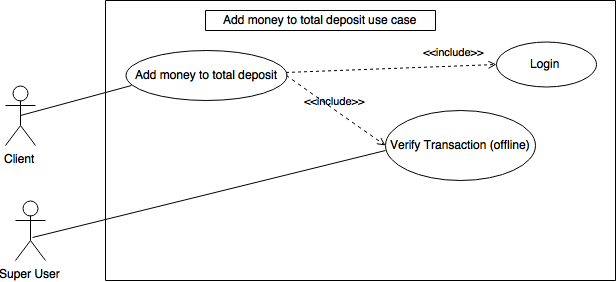
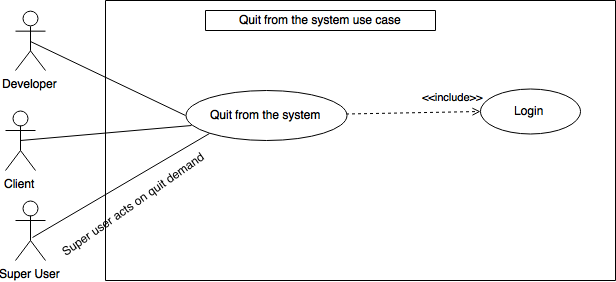
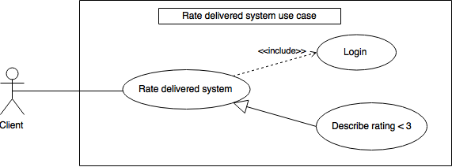
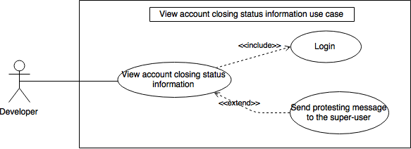

#1. Introduction

##1.1 Purpose

The purpose of this document is to present detailed description of the Turk
system. It will explain the purpose and features of the system, the
interface of the system, what the system will do, the constraints under
which it must operate and how the system will react to external stimuli.
The document will also cover hardware, software and other technical
dependencies.

##1.2 Scope

The Turk system will be a bidding market place for business clients and
software developers. Business clients will post system requirements and
time to complete information - to which developers will bid.

Both clients and developers will have their profile page with relevant
information which would be public for everyone to access. The profile pages
will include their previous work histories and ratings.

Payment processing is expected to be handled by third party or offline
through super user, who will also manage any disagreements over ratings or
payments among other things.

##1.3 Definitions, Acronyms, and Abbreviations

+ **Software Requirements Specification** : A document that completely
  describes all of the functions of a proposed system and the constraints
  under which it must operate.  For example, this document.
+ **Database** : Collection of all the information monitored by this system
+ **Use Case Diagram** : A visual representation of relationship between
  users and their use-interaction with the system
+ **ES6** : A commonly used version of standard javascript language
+ **HTML5** : A commonly used standard version of HTML(hyper text markup
  language, used to structure web documents)
+ **Session Cookie** : A small set of temporary (until user closes browser)
  data sent to user's web browser that is commonly used to identify
  user/session/state

##1.4 References

+ Isatou Sanneh provided sample phase I report.
    + Appropriate parts from the sample have been copied in this document
      with minor changes.
+ Original project\_spec.docx :
    + Appropriate phrases from the docx have been used in this document

##1.5 Overview

The next chapter, the 'Overall Description' section will give an overview
of the functionality of the product. It describes the informal requirements
and is used to establish a context for the technical requirements
specification in the next chapter.

The third chapter, 'Specific Requirements' describes in technical terms,
the details of the functionality of the product.

Both sections of the document describe the same software product.

#2. Overall Description

##2.1 Use-Case Model Survey

Use case diagram follows, use cases will be explained in more details in
later section.

The types of users are Super User, Client, Developer and visitor.

A brief summery of the users are:

+ **Super User**: Controls and handles various changes and exception.
+ **Client**: Posts requirements and pays developer
+ **Developer**: Works on client's requirement when chosen
+ **Visitor**: Non-registered (or temporarily registered) user with limited
  access to view statistics and public information

##2.2 Assumptions and Dependencies

+ All actors must use compatible computer system with standard (unmodified)
  GUI web browser such as Firefox, Google Chrome etc. with HTML5, ES6 and
  session cookie support to connect to the system.
+ For any monetary transactions between client and developer will be charged
  5%, which will be transferred to super user account

#3. Specific Requirements

##3.1 Use-Case Reports

### Use Case: Search public information such as client or developer histories
#### Diagram:
{#id .class width=300px}
{#id .class width=300px}

#### Brief Description

+ Visitor views Client or developer histories such as ratings and project
  details
+ Visitor views grand statistics such as number of clients, developers,
  client(s) with the most projects and developer(s) making most money,
  user account information such as resume, picture, interests, sample
  work/business credentials

#### Initial Step-By-Step Description

1. Visitor goes to the main page/view of the application
2. Visitor identifies:
    1. Search box
        1. Types and enters search term
        2. User views link to matched User/Project
        3. User follows desired link to view project/user histories and
           credentials such as resume, interests, past ratings etc.
    2. Statistics section
        1. View top statistics
        2. Scroll or follow link to view further related information

### Use Case: Apply to be a client or a developer
#### Diagram:
{#id .class width=400px}

#### Brief Description

+ Provide payment deposit (debit/credit card) information: via third
  party or offline, must be successful
+ Submit basic information such as role, location, username/userID etc.
  and a desired password
    + System will check to ensure username is unique to it's database

#### Initial Step-By-Step Description

1. Visitor follow register/login button/link present on most page views
   including main
2. Visitor submit payment information (email, debit/credit card number,
   confirmation number, expiration date, zip code)
3. Visitor fills out form containing role, username, password etc. fields
4. User submits the form

+ On payment submission error : display reason, abort registration
    + On blacklist error: abort, show reason
+ On User information submission error: refund and abort registration,
  show reason
    + On blacklist error: abort, show reason

### Use Case: Add profile details
#### Diagram:
{#id .class width=400px}

#### Brief Description

+ Submit details including an about me, resume, profile photo, interests,
  business credentials or sample work.

#### Initial Step-By-Step Description

1. Visitor follow login button/link present on most page views including
   main
2. Visitor enters the username/userID and logs in to the temporary account.
3. Visitor fills the details about her/himself which includes a about me,
   resume upload, picture upload, interests, business credentials or sample
   work.
4. Visitor updates the entered information.

### Use Case: View application status
#### Diagram:
{#id .class width=400px}

#### Brief Description

+ Visitor can view their current application status information.

#### Initial Step-By-Step Description

1. Visitor follow login button/link present on most page views including
   main
2. Visitor enters the username/userID and logs in to the temporary account.
3. Visitor views the application status on their login page.

### Use Case: View Credential of applicants
#### Diagram:
{#id .class width=400px}

#### Brief Descripton

#### Initial Step-By-Step Description

### Use Case: Discuss/Process dev payment
#### Diagram:
{#id .class width=400px}

#### Brief Descripton

#### Initial Step-By-Step Description

### Use Case: Hires a biding developer
#### Diagram:
{#id .class width=400px}

#### Brief Descripton

+ Client can choose between one of the biding developers to hire

#### Initial Step-By-Step Description

1. Be logged in as client with completed profile
2. Client will choose one from the list of all the biding developers
    1. Half of the biding price will be transferred from the client to the
      winning developer

+ Developer will be able to view the required project deadline and review the 
  terms and conditions of the system

### Use Case: Add money to the total deposit
#### Diagram:
{#id .class width=400px}

#### Brief Descripton

+ Client can add money to the total deposit

#### Initial Step-By-Step Description

1. Be logged in as client with completed profile
2. Client will be allowed to add more money to the deposit before the project
  deadline.

### Use Case: Post system demand
#### Diagram:
{#id .class width=400px}

#### Brief Description

+ Client posts requirements for developer to bid on

#### Initial Step-By-Step Description

1. Be logged in as client with completed profile
2. Submit form with
    1. A paragraph describing the system spec 
    2. Bidding timeline (deadline for the project)

+ Developer will now be able to rate or bid on the project
+ If no developer bids on the project by deadline, client will be charged
  $10

### Use Case: Quit from the system
#### Diagram:
{#id .class width=400px}

#### Brief Description

+ Developer/Client can choose to quit from the system by filing the quit
  demand to the super-user

#### Initial Step-By-Step Description

1. User follow login button/link present on most page views including
   main
2. User submits a form found/linked-from in their profile page with
   optional reason-to-quit text
3. After super user confirms (eg: ensure no pending event, refund any
   amount in deposit etc.) the quit request, user information will no
   longer be available in the system and user will not be able to log back
   into the system without re-registering

### Use Case: Client Rate Developer
#### Diagram:
{#id .class width=400px}

#### Brief Description

+ Client can rate the developer's work after he/she has received
  developer's completed work

#### Initial Step-By-Step Description

1. Client follows login button/link present on most page views including
   main
2. On developers mark on completion of project
    1. Client is asked to rate the delivered product and sends the ratings
       to super-user
3. For rating:
    + \>= 3 : The developer receives the full remaining amount held by super
      user
    + \< 3 : Super user will discuss (offline to the system) with the
      developer and client to decide how much the developer will recieve.
      Any remaining amount will be redunded to the client

### Use Case: Send complain message to the super-user
#### Brief Description

+ Visitor can send a complain message to the super-user

#### Initial Step-By-Step Description

1. Visitor follow login button/link present on most page views including
   main
2. The visitor will write and send the complain to a super-user
3. Super-user will review the complain and decide on the punishment
   accordingly to the severity

### Use Case: View account closing status information
#### Diagram:
{#id .class width=400px}

#### Brief Description

+ User can see if their account has been closed

#### Initial Step-By-Step Description

1. User follow login button/link present on most page views including
   main
2. If the account was submitted to be canceled it will display account has
   been terminated

### Use Case: Bid on any demand with promised timeline and money
#### Diagram:
{#id .class width=400px}

#### Brief Description

+ Developer bids on any demand posted by a client.

#### Initial Step-By-Step Description

1. Be a logged in developer
2. Developer searches list of demands
3. Developer finds demand that matches his desired timeline and money
4. Developer bids on chosen demand

### Use Case: Submit delivered system
#### Diagram:
{#id .class width=400px}

#### Brief Description

+ Developer is required to submit delivered system before posted deadlines,
  otherwise the front money and a fixed penalty will be transferred to the
  client.
  + If developer does not submit on time, he will receive an automatic
    rating of 1.
  + If developer delivers system before or on deadline, the remaining half
    of the price is transferred to the super-user automatically, and the
    developer receives money depending on the rating he is given by the
    client

#### Initial Step-By-Step Description

1. Developer follows login button/link present on most page views including
   main
2. Developer goes to deliver system page
3. Developer delivers system

### Use Case: Rate client
#### Diagram:
{#id .class width=400px}

#### Brief Description

+ Developer can rate client after finishing transaction from 1 to 5
  + A paragraph must be provided for a rating less than or equal to 2

#### Initial Step-By-Step Description

1. Developer follows login button/link present on most page views including
   main
2. After finishing transaction, developer can go to page where he can rate
   the client
3. Developer rates client from 1 to 5 with a paragraph if the rating is 2
   or lower

### Use Case: Send protesting message to the super-user
#### Diagram:
{#id .class width=400px}

#### Brief Description

+ Developer or client sends messages to super user on suspected
  irresponsible evaluations

#### Initial Step-By-Step Description

1. Be a logged in developer or client
2. View warning and deadline to account closing for too high or too low
   ratings on more than 8 projects
3. Find form / link to form to submit protesting request/information on the
   same page as the warning
4. Fill and submit protesting message

+ Super user will check protesting message and may decide to remove
  warning, which will bring back regular access to the system

### Use Case: View account closing status information
#### Diagram:
{#id .class width=400px}

#### Brief Description

+ Developer can login to system one last time for system closing matters
  after getting thrown out of the system
  + Developer can get thrown out of the system for giving too many
    irresponsible ratings

#### Initial Step-By-Step Description

1. Developer follows login button/link present on most page views including
   main
2. Developer views account for system closing matters
3. Developer logs out
4. Account is closed forever

##3.2 Supplementary Requirements

In order to ensure that the system can be long-term, safe, stable, reliable
and efficient operation, the Turk system should meet the requirements
below.

1. The accuracy and timeliness of the system processing The accurate and
   timely treatment is necessary to the performance of the system. The
   system may be subject to current and future workload so this needs
   should be taken into consideration in the system design and development
   process. In addition the system capacity and response time needs to meet
   the demand of user information and request processing.

2. Open system and system scalability The Turk system in the development
   process, should fully consider the future scalability. The system needs
   to adjust and expand functions to provide adequate usage. In order to
   get this, not only should the system be an open system but it also needs
   to meet certain specifications. Through the software of repair, replace
   the complete system upgrade and update.

3. Easy to use and easy to maintain system Turk system is to directly face
   the user which might not be very familiar with computer. This requires
   the system to be able to provide friendly user interface and an easy to
   use interface. To achieve this, the system should try to use different
   languages for different regions of people. A use problem may arise, so
   need to have enough help online, and shorten the process of system user
   familiar.
