#1. Introduction

Introduction an overall picture of the system using collaboration class diagram

#2. Use Cases

The types of users are Super User, Client, Developer and Visitor.

A brief summery of the users are:

+ **Super User**: Controls and handles various changes and exception.
+ **Client**: Posts requirements and pays developer
+ **Developer**: Works on client's requirement when chosen
+ **Visitor**: Non-registered (or temporarily registered) user with limited
  access to view statistics and public information

##2.1 Create an Account

The user-type Visitor will be able to create an account by entering their userid, name, 
deposit amount($), email, password. Users that want to apply to be a client can select
the user-type Client. Users that want to apply to be a developer can select the user-type
developer. Users that want to apply to be a super-user can select the user-type
super-user and enter the super-user key. Client and developer usertypes can add their
deposit amount. Once the user enters submit, the user's user id and email will be 
validated by the system to check the uniqueness of the user id and email. If the user id 
or email address of the user is not unique, the system will send an exception message
to the user stating the error. The user can then re-enter a new user id or email. The 
user will have to enter the password and the password-confirmation while creating an
account. If the password and password-confirmation does not match, the system will send
an exception message to the user stating the error. The user can then re-enter these 
two fields.

Precondition: User is connected to the internet

Normal Scenarios:

 1. User enters their userID, name, email, password, password confirmation and desired usertype.
 2. User's email and userID validation for uniqueness
 3. User's password and password confirmation for match
 4. User is redirected to the welcome GUI interface

Exception Scenarios:

 1. User does not enter a required field
 	+ Display error message to user to enter all the required fields/information
 2. User's email and userID already exists in the database
    + Display error message stating email or userID is not unique
 3. User's password and password confirmation does not match
    + Display error message to user stating the password does not match the confirmatio

##2.2 Sign-in

The user can Sign-in by entering their email and password. If the user's email exists 
in the system, the system will verify the password. If not the system will ask the 
user to re-enter the email or create a new account. The user will be able to use the 
turk-system if the password is valid. If the password is not valid the user will be 
asked to re-enter their password. 

Precondition: User is connected to the internet

Normal Scenarios:

 1. User enters their email and password
 2. User's email address is validated against the database for match
 3. User's password is validated against the database for match
 4. User is redirected to the welcome GUI interface

Exception Scenarios:

 1. User does not enter a required field
 	+ Display error message to user to enter all the required fields/information
 2. User's email address does not match
    + Display error message to user stating email is not found
 3. User's password does not match
    + Display error message to user stating password is does not match

##2.3 Search Public Information

Precondition: User is connected to the internet
			  User is logged in the system

Normal Scenarios:

 1. User visits the welcome GUI interface
 2. User types the search query in the search box and searches
 3. User's search query is validated
 4. System displays the matched result of the search query of links to Users or projects
 5. User follows desired links to view project/user histories and credentials
 6. User is redirected to the respective link's GUI interface

Exception Scenarios:

 2. User does not enter any information on the search query
       + Display error message to user to enter all the required fields/information
 3. No result matched with the database
       + Display error message stating no result found
       + Prompt user to re-enter the search query

##2.4 Add Profile Details

Precondition: User is connected to the internet
			  User is logged in the system

Normal Scenarios:

 1. User views the welcome GUI interface and visits the profile
 2. User selects the Add more information
 3. User enters information about her/himself including resume, picture, interests
 4. Usertype - Developers add sample work
 5. Usertype - Clients add business credentials

Exception Scenarios:

 3. User does not enter a required information
       + Prompt error message to user asking for the required information
 4. Usertype - Developers does not enter any sample work
       + Prompt error message to user asking for the required information
 5. Usertype - Client does not enter any business credentials
       + Prompt error message to user asking for the required information

##2.5 View Application Status

Precondition: User is connected to the internet
			  User is logged in the system

Normal Scenarios:

 1. Usertype - Visitor views the main GUI interface
 2. User views the application status on the main page
 3. Add more details feature is disabled or enabled based on the application status

Exception Scenarios:

 2. No status available for that user
    + Prompt error message to user stating there is no status information available

##2.6 Hire a Biding Developer

Precondition: User is connected to the internet
			  User is logged in the system
			  Usertype is client

Normal Scenarios:

 1. Usertype - Client visits the main GUI interface
 2. Client selects view bidding developers option
 3. Redirect client to the list of all bidding developers for the system demand
 4. Client clicks on the bidding developer to hire
 5. Confirmation is sent and verified in the system
 6. Half of the bidding price is transferred from the client to the winner developer

Exception Scenarios:
 
 3. No bidding developers were found in the system
    a. The posted deadline has passed
        +  Redirect client to the project removed and $10 fees charged information page
    b. The posted deadline has not passed
        +  Prompt client with message that no bids placed for this system 
 4. Client clicked on the bidding developer of non-lowest price
    a. Prompt a justification text-field for client requesting the reason
 5. Client does not have enough amount in their account
    a. Send wraning message to the client and prompt them to add money

##2.7 Add Money to the Total Deposit

Precondition: User is connected to the internet
			  User is logged in the system
			  Usertype is client

Normal Scenarios:

 1. Usertype - Client visits the main GUI interface
 2. Client selects Add money to total deposit option
 3. Redirect client form with amount field
 4. Client clicks the confirm option
 5. Confirmation is sent and verified in the system

Exception Scenarios:
 
 3. Client did not enter any amount
    + Prompt error message to user asking for the required information
 4. Deadline for adding deposit has already passed
    + Prompt user that the deadline has already passed
    + Redirect client fees charged information page 

##2.8 Post System Demand

Precondition: User is connected to the internet
			  User is logged in the system
			  Usertype is client

Normal Scenarios:

 1. Usertype - Client visits the main GUI interface
 2. Client selects post a system demand option
 3. Client enters information including a paragraph describing system spec.
 4. Client enters information for bidding timeline 
 5. Client submits the system demand

Exception Scenarios:
 
 5. Client did not enter required information
    + Prompt error message to user asking for the required information

##2.9 Quit From the System

Precondition: User is connected to the internet
			  User is logged in the system

Normal Scenarios:

 1. User visits the main GUI interface
 2. User selects Quit from System option
 3. User enters option information for reson-to-quit text-field
 4. User enters submit button
 5. System sends user information for final review from the super-user
 6. User views final review from the super-user
 7. User is redirected to the exit page

Exception Scenarios:
 
 6. User has unpaid/unfinished system demand
    + Prompt user the reason for why they can not quit the system yet

##2.10 Client Rate Delivered System

Precondition: User is connected to the internet
			  User is logged in the system
			  Usertype is client
			  The required system is delivered to the client

Normal Scenarios:

 1. Client visits the main GUI interface
 2. Client selects the Rate delivered system option 
 3. Client is redirected to the page with all the delivered system for that client
 4. Client clicks on the system that they want to rate
 5. Client enters the desired rating for the system
 6. Client submits the rating for the system
 7. Rating verified by the system

Exception Scenarios:

 7. a. Rating is higher than 3
    + Transfer the remaining bid money held by the super-user to the corresponding developer
    b. Rating is lower than 2
    + Prompt the user with the note text-field about the reason of the low feedback

##2.11 Bid on Any Demand With Promised Timeline and Money

Precondition: User is connected to the internet
			  User is logged in the system
			  Usertype is developer		

Normal Scenarios:

 1. Developer visits the main GUI interface
 2. Developer selects the View System Demands option 
 3. Developer is redirected to the page with all the current system demands
 4. Developer clicks on the system demands that they want to bid on
 5. Developer enters all the required fields for the bid 
 6. Developer submits the bid to the client
 7. Submission is verified by the system

Exception Scenarios:

 3. a. No system demands avaiable in the turk-system
    + Prompt user that there is no system demands posted
 6. a. Developer did not enter required information for the bid
    + Prompt user asking for the required information for the bid

##2.12 Submit Delivered System

Precondition: User is connected to the internet
			  User is logged in the system
			  Usertype is developer		

Normal Scenarios:

 1. Developer visits the main GUI interface
 2. Developer selects the Submit system option 
 3. Developer is redirected to the page with all the systems for that developer
 4. Developer clicks on the system that they want to submit
 5. Developer enters all the required fields for the system delivery
 6. Developer submits system to the client
 7. Submission is verified by the system

Exception Scenarios:

 7. a. Developer submitted the system before or on the deadline
    + Transfer the remaining half of the system bid amount to the super-user account
    b. Developer submitted the system after the deadline
    + Transfer the front bid amount and fixed penalty from the developer to the client
    + Rate developer with 1 rating

##2.13 Rate Client

Precondition: User is connected to the internet
			  User is logged in the system
			  Usertype is developer		

Normal Scenarios:

 1. Developer visits the main GUI interface
 2. Developer selects the Submit system option 
 3. Developer is redirected to the page with all the systems for that developer
 4. Developer clicks on the client that they want to rate
 5. Developer enters the rating for client
 6. Developer submits the rating
 7. Submission is verified by the system

Exception Scenarios:

 5. Developer entered rating lower than 2
    + Prompt user to enter a paragraph for the low rawting

##2.14 Send Protesting Message to the Super-User

Precondition: User is connected to the internet
			  User is logged in the system
			  Usertype is developer or client		

Normal Scenarios:

 1. User visits the main GUI interface
 2. User selects the View warning and deadline option 
 3. User is redirected to the page with a form to submit protesting request
 4. User enters the required information in the form
 5. User submits protest message
 6. Submission is verified by the system

Exception Scenarios:

 4. User did not enter all required information in the protest form
    + Prompt user to enter the required information

##2.15 View Account Closing Status Information

Precondition: User is connected to the internet
			  Usertype is developer or client
			  User is thrown out of the system 		

Normal Scenarios:

 1. User logs into the system
 2. User visits the main GUI interface 
 3. User views the Closing status information
 4. User logs out
 5. System adds user to the black-list

#3. E-R Diagram

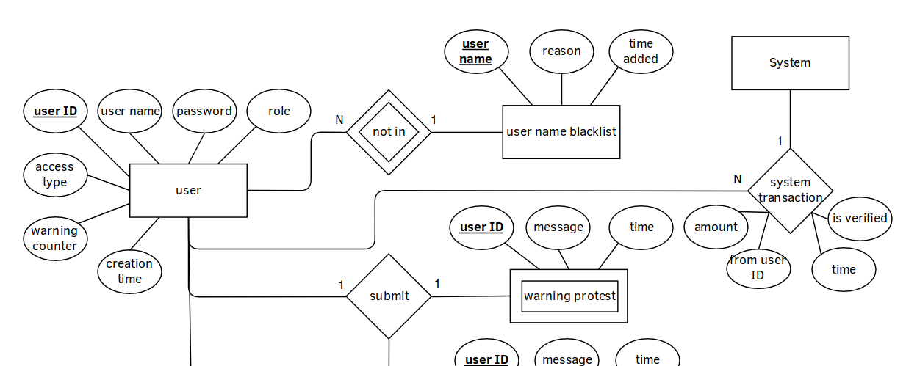
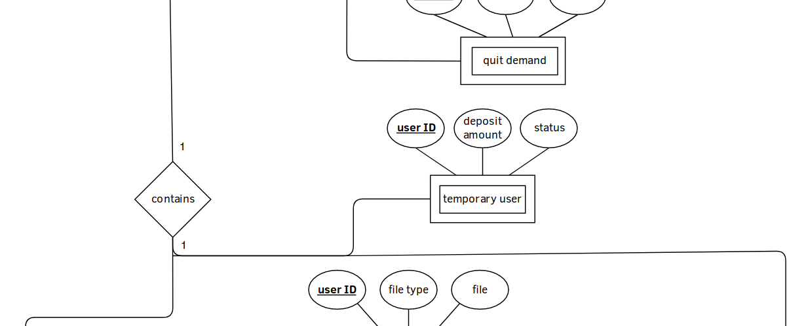
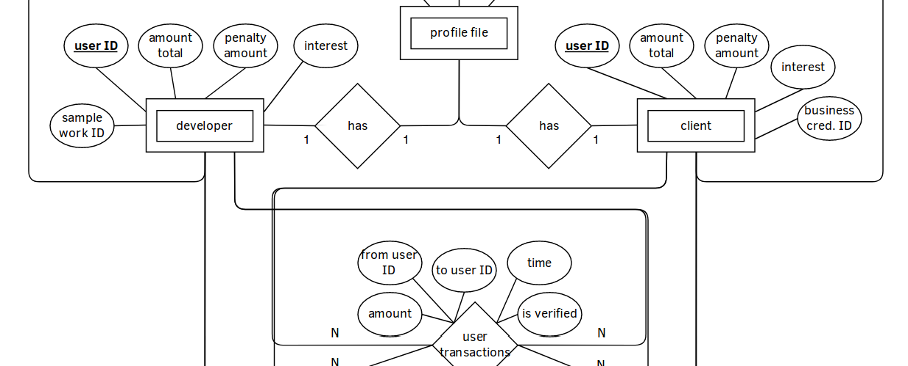
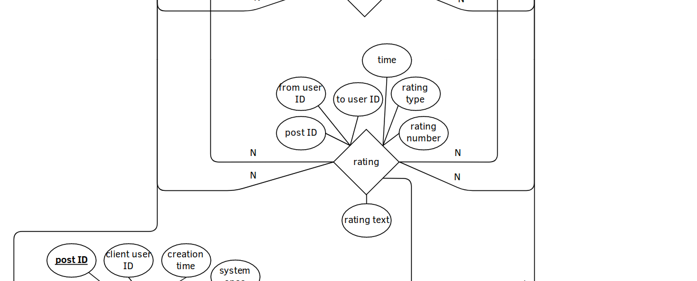
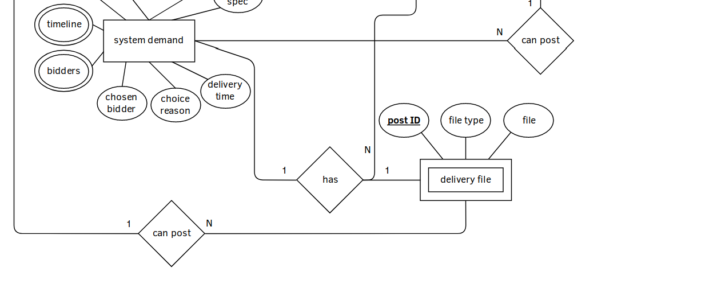

#4. Detailed Design

##4.1 All User Methods:

~~~~~~~
login_to_the_system(username, password)
	bool value = verify_login_credential(username, password)
	if value == true
		sucessfully login
		redirect user to the main GUI interface
	else
		unsucessful login
		redirect user to the login GUI interface
~~~~~~~

~~~~~~~
logout_from_the_system(username)

~~~~~~~

~~~~~~~

~~~~~~~

##4.2 Client Methods:
~~~~~~~
update_profile_for_client(business credential)

~~~~~~~

##4.3 Developer Methods:

~~~~~~~
update_profile_for_devs(userStatus, userID, resume, interests, sample_work)
	if userStatus == accepted
		userdetails = findUser(userID)
		userdetails.append(resume)
		userdetails.append(sample_work)
		save_to_system(userdetails)
	else
		displayexecption(msg)
~~~~~~~

##4.4 Visitor Methods:

##4.5 Super User Methods:

#5. System Screens

##5.1 Main Page for Login and Registeration Screen

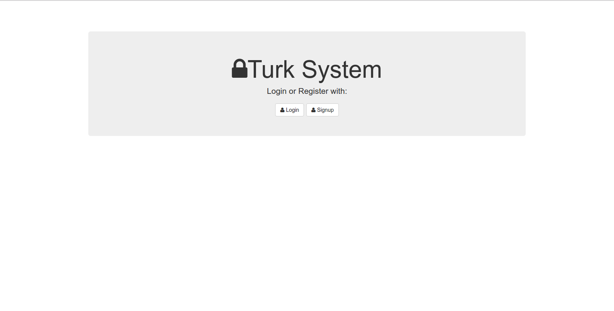

##5.2 Registeration Screen

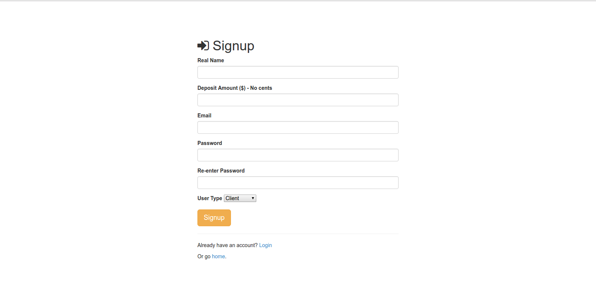

##5.3 Login Screen

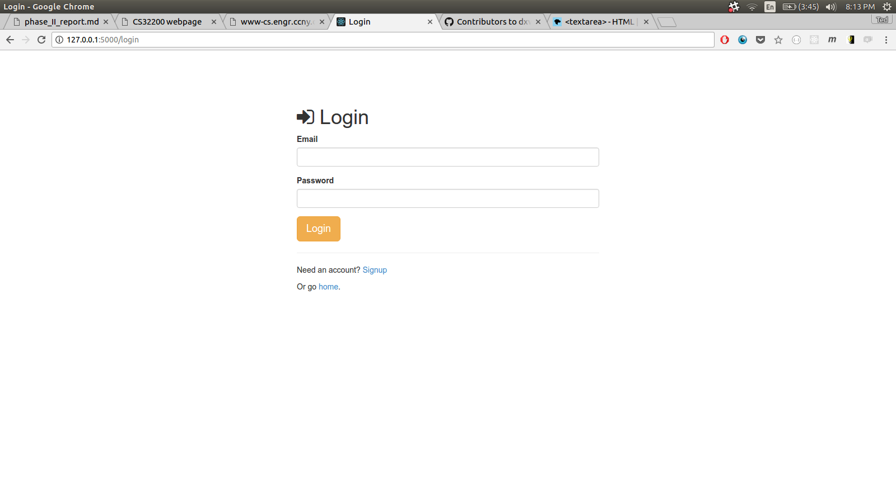

##5.4 Welcome Screen

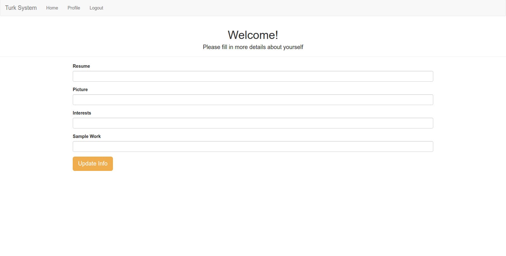

##5.4 Most Active Users Screen

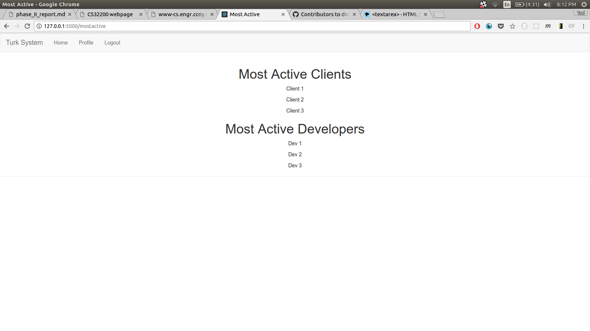

##5.5 System Demand Screen

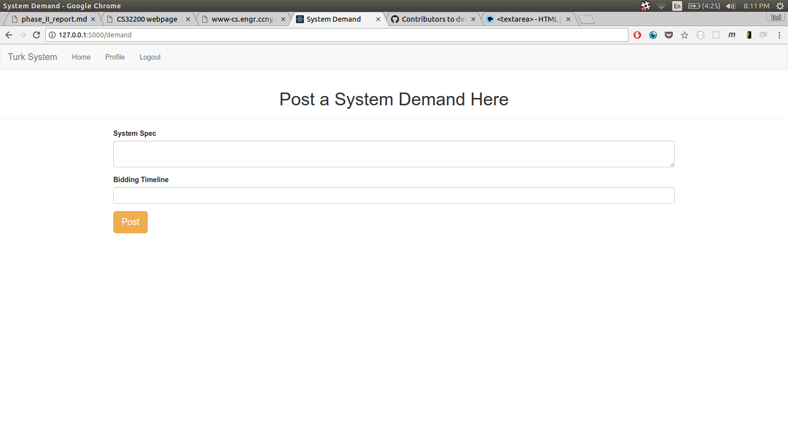

##5.6 User Applications Screen

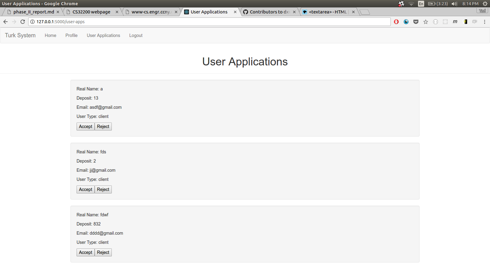

##5.7 Payment Screen

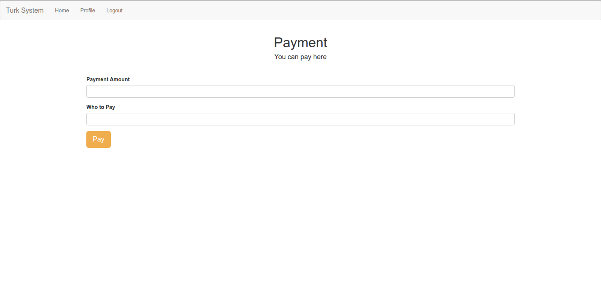

#6. Minutes of Group Meetings

#7. Phase I Report Feedback
